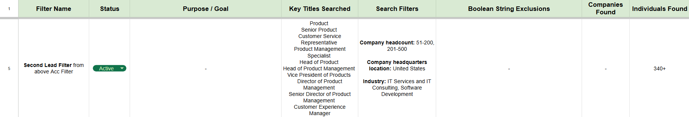

# Xgrid's Step-by-Step Approach for LinkedIn Outreach and Customer Identification

This document outlines the systematic approach used by the Xgrid's technical writing team to identify and engage potential customers on LinkedIn.

### Objective

The primary goal of this outreach strategy is to identify B2B SaaS companies that require technical documentation services, establish initial contact with key decision-makers, and generate qualified leads.

### Step 1: Defining Target Personas

The first step was to identify the key roles within a company that are most likely to be responsible for or impacted by technical documentation.

* **Who:** Documentation Leaders (e.g., Technical Writing Managers, Documentation Specialists) and Product Leaders (e.g., Product Managers, Head of Product).

* **Why:** These individuals are typically the primary decision-makers or influencers for procuring documentation services. Docs leaders manage existing teams and resources, while product leaders are directly affected by how documentation impacts user experience and product adoption.

### Step 2: Building the Target Account List

A filtered list of potential companies was created using LinkedIn Sales Navigator to serve as the initial pool for lead generation.

* **Action:** An Account Filter was applied in Sales Navigator with the following criteria:

    * **Company Size:** 51-200 and 201-500 employees. (To target mid-sized companies that are large enough to need the service but may not have a dedicated in-house team).
    * **Industry:** IT Services and IT Consulting, Software Development.
    * **Geography:** USA.
    * **Keywords (Include):** "SaaS" OR "Software as a Service".
    * **Keywords (Exclude):** "technical writing", "documentation services", "content strategy", "knowledge base software", "headless CMS", etc.

* **Reasoning:** The exclusion filter was critical. By intentionally filtering out companies that already specialize in documentation or related fields, the list was refined to identify companies that are likely consumers of documentation services, not providers.

* **Result:** This process yielded a targeted list of 176 companies that fit the ideal customer profile.

### Step 3: Lead Identification and Segmentation

From the master account list of 176 companies, two distinct lead lists were generated to tailor the outreach message.

#### A. Documentation Professionals List

This search was conducted to see which of the target companies already had dedicated documentation personnel.

* **Action:** A Lead Filter was applied to the account list, searching for titles like "Technical Writer," "Documentation Manager," "Information Developer," etc.
* **Result:** 16 documentation-relevant individuals were identified.
* **Strategy:** This segmentation allows for a two-pronged approach:
    * For companies with doc teams: The outreach can be positioned as a service to augment or enhance their existing documentation (e.g., API documentation, specific guides).
    * For companies with no visible doc team: The outreach can be positioned as a comprehensive, end-to-end documentation solution.

#### B. Product Leaders List

This search was conducted to identify the primary decision-makers and stakeholders in product development.

* **Action:** A second Lead Filter was applied to the account list, searching for titles like "Product Manager," "Head of Product," "Director of Product Management," etc.
* **Result:** 776 relevant individuals were identified.
* **Strategy:** These professionals are the primary target for outreach, as they directly experience the challenges of poor documentation (e.g., high support ticket volume, poor user onboarding) and understand its value.

### Step 4: Execution of Outreach

A controlled and personalized outreach process was initiated.

* **Action:** Connect with 10 targeted individuals from the Product Leaders and Tech Writers lists on LinkedIn daily.

* **Follow-up:** For each person who accepts the connection request:
    
    **1. For Product Managers:** Send a personalized conversational message to start a dialogue about their potential documentation needs. The process then involves awaiting their response to qualify them as a lead.

    

    **2. For Tech Writers:** Share the targeted Google survey to gather their documentation painpoints and approachs. The process then involves awaiting their response to qualify them as a lead.

    

To be Continued...